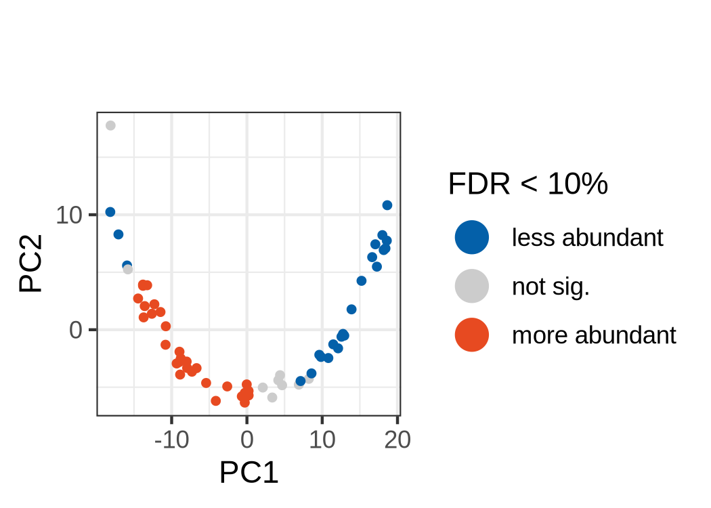
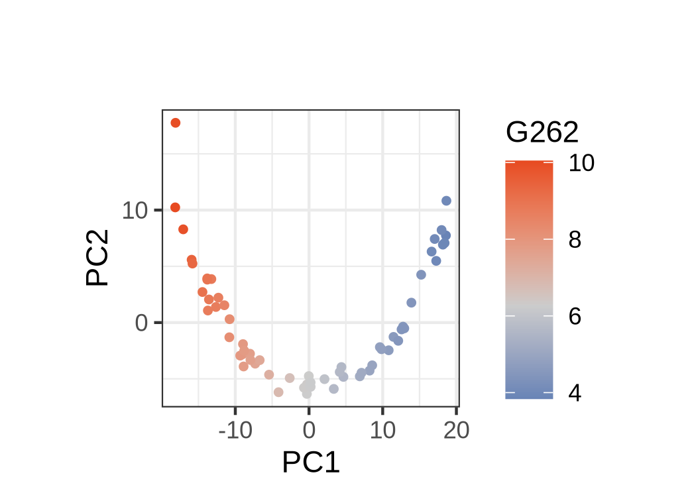

    
```{r, include = FALSE}
knitr::opts_chunk$set(
    collapse = TRUE,
    comment = "#>",
    fig.path = "man/figures/README-",
    fig.width = 3.5,
    fig.height = 2.5
)
```

# tinydenseR <a href="artwork/tinydenseR_hex_piano_behind.png"></a>

<!-- badges: start -->
[](https://github.com/Novartis/tinydenseR/actions/workflows/R-CMD-check.yaml)
[](https://app.codecov.io/gh/Novartis/tinydenseR)
[](LICENSE.md)
[](https://lifecycle.r-lib.org/articles/stages.html)
[](https://github.com/Novartis/tinydenseR/releases)
<!-- badges: end -->

## Table of Contents

- [Overview](#overview)
- [Key Features](#key-features)
- [Installation](#installation)
- [Quick Start](#quick-start)
- [Background](#background)
- [How it Works](#how-it-works)
- [Detailed Example](#detailed-example)
- [Getting Help](#getting-help)
- [Contributing](#contributing)
- [Citation](#citation)
- [License](#license)
- [Note](#note)

## Overview

`tinydenseR` is a landmark‑based R package for single-cell data analysis that goes beyond traditional clustering approaches. Instead of treating each cell as an independent biological replicate, tinydenseR considers samples as the true biological units, enabling more accurate statistical modeling and interpretation.

**Why use `tinydenseR`?** Traditional single-cell analysis methods rely heavily on clustering, which can be oversimplified and subjective. `tinydenseR` provides a clustering-independent framework that preserves biological complexity while maintaining statistical rigor.

## Key Features

- **🎯 Sample-centric analysis**: Treats samples, not cells, as biological replicates for proper statistical modeling
- **🚀 Memory efficient**: Handles atlas-scale datasets with minimal memory footprint  
- **🔬 Multi-technology support**: Works with scRNA-seq, flow cytometry, mass cytometry (multi-modal data support coming soon)
- **📊 Rich visualizations**: Built-in plotting functions for exploring results
- **🔗 Clinical integration**: Links cell-level variation to clinical and experimental outcomes
- **⚡ Fast processing**: Efficient algorithms for large-scale data analysis

## Installation

### System Requirements

- R version 4.1 or higher

You can install `tinydenseR` from GitHub using devtools:

```r
# Install devtools if you haven't already
if (!require("devtools")) install.packages("devtools")

# Install `tinydenseR`
devtools::install_github("Novartis/tinydenseR")
```

### Dependencies

`tinydenseR` requires R (>= 4.1) and several Bioconductor and CRAN packages. Most dependencies will be installed automatically, but you may need to install Bioconductor and its dependencies first:

```r
if (!requireNamespace("BiocManager", quietly = TRUE)) {
  install.packages("BiocManager")
}

# Download DESCRIPTION from GitHub
data_url <-
  "https://raw.githubusercontent.com/Novartis/tinydenseR/main/DESCRIPTION"
temp_file <-
  tempfile()
utils::download.file(
  url = data_url, 
  destfile = temp_file, 
  mode = "wb",
  quiet = TRUE)

# Parse Imports
desc <-
  read.dcf(file = temp_file)
imports <-
  strsplit(x = desc[, "Imports"],
           split = "\\s*,\\s*")[[1]]
imports <-
  gsub(pattern = "\\s*\\(.*?\\)", 
       replacement = "", 
       x = imports)  # remove version constraints

# Install only missing Bioconductor packages
avail.bioc.pkgs <-
  BiocManager::repositories() |>
  (\(x)
  available.packages(repos = x)
  )() |>
  rownames() 

bioc_pkgs <-
  imports[imports %in%
            avail.bioc.pkgs[!avail.bioc.pkgs %in% 
                              (installed.packages() |>
                                 rownames())]]
if (length(bioc_pkgs) > 0) {
  BiocManager::install(pkgs = bioc_pkgs)
}

unlink(temp_file)

```

### Example Data

Examples in this README use simulated trajectory data that is automatically fetched from the [miloR package repository](https://github.com/MarioniLab/miloR). This data is sourced from:

> Dann, E., Henderson, N.C., Teichmann, S.A. et al. Differential abundance testing on single-cell data using k-nearest neighbor graphs. *Nat Biotechnol* (2021). https://doi.org/10.1038/s41587-021-01033-z


## Quick Start

Here's a minimal example to get you started:

```{r eval=FALSE}

# Note: This example downloads data from miloR (GPL v3 licensed)
# for demonstration purposes only

library(tinydenseR)

# Try to fetch trajectory data from miloR repository
# If no internet connection, use miloR package directly
if (curl::has_internet()) {
    # Fetch example data from miloR repository
    sim_trajectory <- fetch_trajectory_data()
    
} else {
    # Fall back to using miloR package directly
    message("No internet connection detected. Using miloR package data directly.")
    library(miloR)
    data(sim_trajectory)
    SummarizedExperiment::colData(x = sim_trajectory$SCE) <-
        S4Vectors::DataFrame(as.list(x = sim_trajectory$meta))
    colnames(x = sim_trajectory$SCE) <- 
        sim_trajectory$meta$cell_id
}

# Extract components 
sim_trajectory.meta <- 
    sim_trajectory$meta
sim_trajectory <-
    sim_trajectory$SCE

# Create .min.meta for 2-sample example  
.min.meta <-
    tinydenseR::get.meta(.obj = sim_trajectory,
                         .sample.var = "Sample",
                         .verbose = FALSE)[c("A_R1", "B_R1"),]

# Create .cells object using SCE method
.min.cells <-
    tinydenseR::get.cells(.exprs = sim_trajectory,
                          .meta = .min.meta,
                          .sample.var = "Sample")[rownames(x = .min.meta)]

# Set up the landmark object
lm.cells <-
    tinydenseR::setup.lm.obj(
        .cells = .min.cells,
        .meta = .min.meta, 
        .assay.type = "RNA",
        .prop.landmarks = 0.05
    ) |>
    tinydenseR::get.landmarks(.nHVG = 500,
                              .nPC = 3) |>
    tinydenseR::get.graph(.k = 5) |>
    tinydenseR::get.map()

# Visualize results
tinydenseR::plotPCA(.lm.obj = lm.cells,
                    .point.size = 1,
                    .panel.size = 1.5)
```

## Background

Single-cell technologies have revolutionized our understanding of cellular biology, but current analysis methods face significant challenges:

### The Problem with Current Methods

**Clustering limitations**: Most single-cell analysis tools rely heavily on clustering algorithms, which can be:

- Oversimplistic for complex biological systems

- Sensitive to parameter choices and method selection

- Poor at capturing cell states at cluster boundaries

- Subjective and labor-intensive to optimize

**Statistical modeling issues**: Traditional approaches treat each cell as an independent biological replicate, which:

- Ignores the hierarchical structure of biological systems (cells within samples)

- Exaggerates differences between cell populations

- Can lead to misleading statistical conclusions

### The `tinydenseR` Solution

`tinydenseR` addresses these challenges by:

1. **Using samples as biological replicates**: This respects the true experimental design and enables proper statistical inference
2. **Providing clustering-independent analysis**: Reduces subjectivity and captures biological complexity more accurately  
3. **Linking cellular variation to outcomes**: Connects cell-level changes to clinical, experimental, or treatment variables
4. **Scaling to large datasets**: Efficient algorithms handle atlas-scale data with minimal memory requirements

This approach enables researchers to answer the key question: **"How does cellular variation relate to sample-level outcomes?"**

## How it Works

`tinydenseR` uses a straightforward three-step process to analyze single-cell data:

<a href="man/figures/README1.png"></a>

### Step 1: Identify Landmarks 🗺️
- Select representative cells that capture the diversity of your entire dataset
- These "landmark" cells serve as reference points for all subsequent analysis

### Step 2: Map Cells to Landmarks 📍
For each sample:

- **Map**: Determine how similar each cell is to each landmark

- **Calculate probabilities**: Estimate the likelihood that each cell belongs to each landmark's neighborhood  

- **Sum probabilities**: Add up all the probabilities for each landmark (this gives you the "density" estimate)

*Higher density = many cells are similar to that landmark*

### Step 3: Link to Outcomes 🔗

- Use the density estimates as features in statistical models

- Connect cellular variation patterns to your experimental variables, treatments, or clinical outcomes

- Generate insights about which cell states are associated with your conditions of interest

<a href="man/figures/README2.png"></a>

- Use cell states associated with outcomes to identify key genes or markers

- `tinydenseR` automatically generates pseudo-bulks of cells mapped to landmarks of interest

<a href="man/figures/README3.png"></a>


This approach captures the complexity of cell-to-cell variation while maintaining statistical rigor by treating samples (not individual cells) as the unit of biological replication.


## Detailed Example

This example demonstrates a complete `tinydenseR` analysis workflow using simulated trajectory data with two conditions (A and B) across three replicates each.

### Load Libraries and Data

```{r include=TRUE, echo=TRUE, eval=TRUE}

# Note: This example downloads data from miloR (GPL v3 licensed)
# for demonstration purposes only

library(tinydenseR)
library(tidyverse)

# Check package version
if(utils::packageVersion(pkg = "tinydenseR") < "0.0.1.0011") {
  stop("please update the installation of tinydenseR")
}

# Try to fetch trajectory data from miloR repository
# If no internet connection, use miloR package directly
if (curl::has_internet()) {
  # Fetch trajectory data from miloR repository
  sim_trajectory <- fetch_trajectory_data()
  
  # Extract components
  sim_trajectory.meta <- sim_trajectory$meta
  sim_trajectory <- sim_trajectory$SCE
} else {
  # Fall back to using miloR package directly
  message("No internet connection detected. Using miloR package data directly.")
  library(miloR)
  data(sim_trajectory)
  
  # Extract components (miloR format is already the expected structure)
  sim_trajectory.meta <- sim_trajectory$meta
  sim_trajectory <- sim_trajectory$SCE
  
  SingleCellExperiment::colData(x = sim_trajectory) <-
  sim_trajectory.meta

}
```

### Prepare Data for Analysis

```{r include=TRUE, echo=TRUE, eval=TRUE}
# Create .meta object containing sample-level data
.meta <- get.meta(.obj = sim_trajectory,
                  .sample.var = "Sample",
                  .verbose = FALSE)

# Create .cells object using SCE method
.cells <- get.cells(.exprs = sim_trajectory,
                    .meta = .meta,
                    .sample.var = "Sample")[rownames(.meta)]

```

### Set Up Landmark Object

```{r include=TRUE, echo=TRUE, eval=TRUE}
set.seed(seed = 123)

# Create the main tinydenseR object
lm.cells <- tinydenseR::setup.lm.obj(
    .cells = .cells,                    # Expression data
    .meta = .meta,                      # Sample metadata  ,       
    .assay.type = "RNA",              # Data type
    .prop.landmarks = 0.15,           # Proportion of cells to use as landmarks
    .verbose = FALSE
) |>
    # Find highly variable genes and create landmarks
    tinydenseR::get.landmarks(.nHVG = 500, 
                              .nPC = 3,
                              .verbose = FALSE) |>
    
    # Build neighborhood graph
    tinydenseR::get.graph(
        .cl.resolution.parameter = 2e2, 
        .k = 10,
        .small.size = 3,
        .verbose = FALSE
    )

# Map all cells to landmarks
lm.cells <- tinydenseR::get.map(.lm.obj = lm.cells,
                               .verbose = FALSE)
```

### Access fuzzy landmark-by-sample density matrix

```{r include=TRUE, echo=TRUE, eval=TRUE}
# View first 10 landmarks and their density estimates across samples
lm.cells$map$fdens |> 
  (\(x)
   x[, order(colnames(x = x))]
   )() |> 
  round(digits = 2) |>
  head(n = 10) |>
  knitr::kable()
```

### Statistical Analysis

```{r include=TRUE, echo=TRUE, eval=TRUE}
# Set up design matrix for statistical testing
.design <- model.matrix(object = ~ Condition + Replicate,
                       data = .meta)

# Test for differential abundance between conditions
condition.stats <- tinydenseR::get.stats(
    .lm.obj = lm.cells,
    .design = .design,
    .verbose = FALSE 
)

# Perform differential expression analysis
.dea <- tinydenseR::get.dea(
    .lm.obj = lm.cells,
    .design = .design, 
    .verbose = FALSE
)
```

### Visualization

```{r include=TRUE, echo=TRUE, eval=FALSE, dpi=300}
# Show density fold changes between conditions
tinydenseR::plotPCA(
    .lm.obj = lm.cells,
    .feature = condition.stats$fit$coefficients[,"ConditionB"],
    .panel.size = 1.5,
    .point.size = 1,
    .color.label = "estimated density\nlog2 fold change",
    .midpoint = 0
)

# Highlight significantly different regions
tinydenseR::plotPCA(
    .lm.obj = lm.cells,
    .feature = ifelse(
        test = condition.stats$fit$coefficients[,"ConditionB"] < 0,
        yes = "less abundant",
        no = "more abundant") |>
        ifelse(
            test = condition.stats$fit$pca.weighted.q.fdr[,"ConditionB"] < 0.1,
            no = "not sig.") |>
        factor(levels = c("less abundant", "not sig.", "more abundant")),
    .cat.feature.color = Color.Palette[1,c(1,6,2)],
    .color.label = "FDR < 10%",
    .point.size = 1,
    .panel.size = 1.5
)
```

<a href="man/figures/README-unnamed-chunk-8-1.png"></a>

<a href="man/figures/README-unnamed-chunk-8-2.png"></a>

### Explore Individual Genes

```{r include=TRUE, echo=TRUE, eval=FALSE, dpi=300}
# Find most downregulated gene in condition B
most_down_gene <- sort(.dea$coefficients[,"ConditionB"])[1] |> names()

tinydenseR::plotPCA(
    .lm.obj = lm.cells,
    .feature = lm.cells$lm[,most_down_gene],
    .panel.size = 1.5,
    .point.size = 1,
    .color.label = most_down_gene
)

# Find most upregulated gene in condition B  
most_up_gene <- sort(.dea$coefficients[,"ConditionB"], decreasing = TRUE)[1] |> names()

tinydenseR::plotPCA(
    .lm.obj = lm.cells,
    .feature = lm.cells$lm[,most_up_gene],
    .panel.size = 1.5,
    .point.size = 1,
    .color.label = most_up_gene
)
```

<a href="man/figures/README-unnamed-chunk-9-1.png"></a>

<a href="man/figures/README-unnamed-chunk-9-2.png"></a>


### Interactive Exploration

```{r include=TRUE, echo=TRUE, eval=FALSE, dpi=300}
# Add feature statistics for interactive exploration
lm.cells <- 
  tinydenseR::get.lm.features.stats(.lm.obj = lm.cells)

# Create interactive plot with hover information
tinydenseR::plotPCA(
    .lm.obj = lm.cells,
    .hover.stats = "marker",
    .panel.size = 1.5,
    .point.size = 1
)
```

## Getting Help

### Documentation

- **Function documentation**: Use `?function_name` in R for detailed help on any function

- **Reproducible scripts**: Check the `inst/scripts/` directory for example workflows

### Troubleshooting Common Issues

**Installation problems:**

- Ensure you have R >= 4.1

- Install BiocManager first: `install.packages("BiocManager")`

- Try installing dependencies manually if automatic installation fails

**Questions and Support:**

- 🐛 Report bugs: [GitHub Issues](https://github.com/Novartis/tinydenseR/issues)

- 💬 Discussions: Use GitHub Discussions for general questions

## Contributing

We welcome contributions to `tinydenseR`! Here's how you can help:

### Types of Contributions

- 🐛 **Bug reports**: Found an issue? Please report it!

- ✨ **Feature requests**: Have an idea for improvement? We'd love to hear it!

- 📖 **Documentation**: Help improve our docs and examples

- 🧪 **Testing**: Add test cases or test on your data

- 💻 **Code**: Submit bug fixes or new features

### How to Contribute

1. **Fork** the repository on GitHub

2. **Create** a new branch for your changes

3. **Make** your changes and add tests if applicable

4. **Test** your changes thoroughly

5. **Submit** a pull request with a clear description

## Citation

If you use `tinydenseR` in your research, please cite:

```
Milanez-Almeida, P. et al. (2025). tinydenseR: Linking Cell-To-Cell Variation to 
Sample-to-Sample Variation. R package version 1.0.0.
```

## License

The code is licensed under the MIT License (see [LICENSE.md](LICENSE.md)).

The sticker artwork (PNG) is licensed under CC0 (see [LICENSE-artwork](LICENSE-artwork)).

Copyright 2025 Novartis Biomedical Research Inc.

## Note

This is an open‑source package by the authors; not an official Novartis mark or program.

---

*tinydenseR: Making single-cell analysis more rigorous, one sample at a time* 🧬📊
