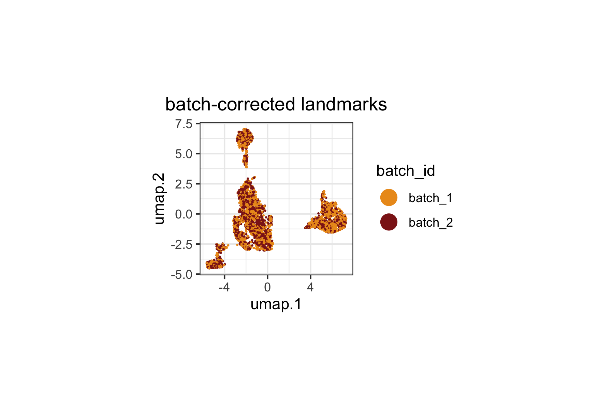
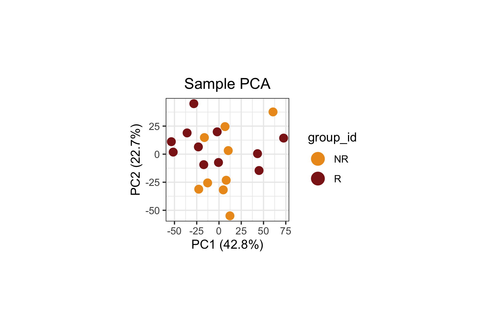
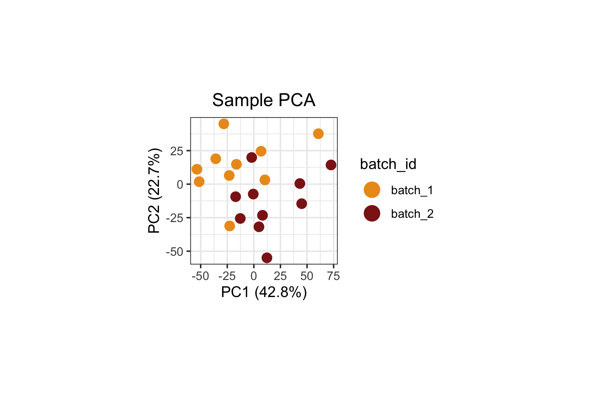
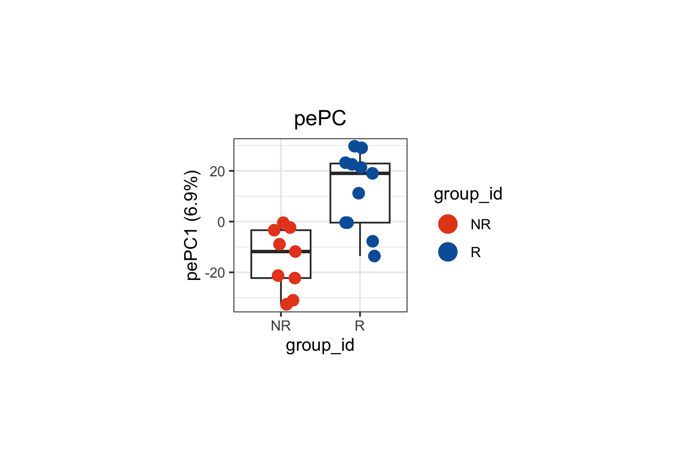
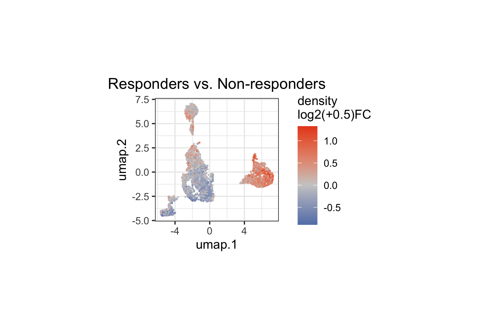
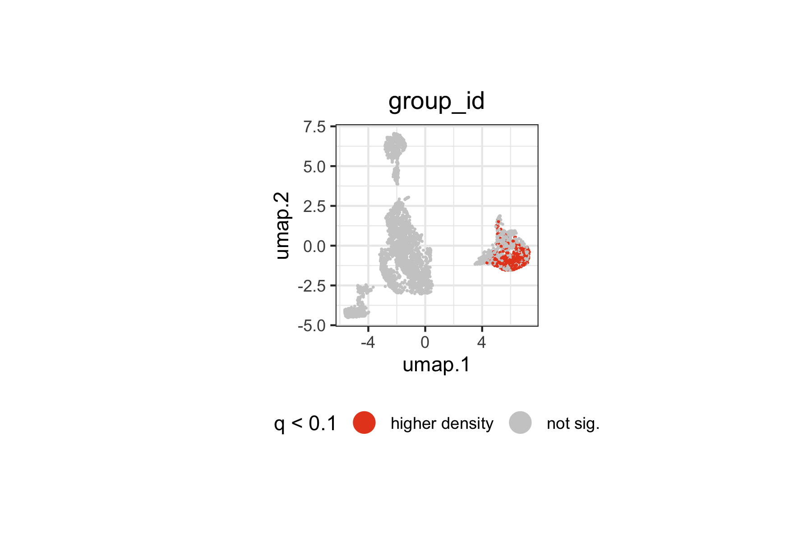
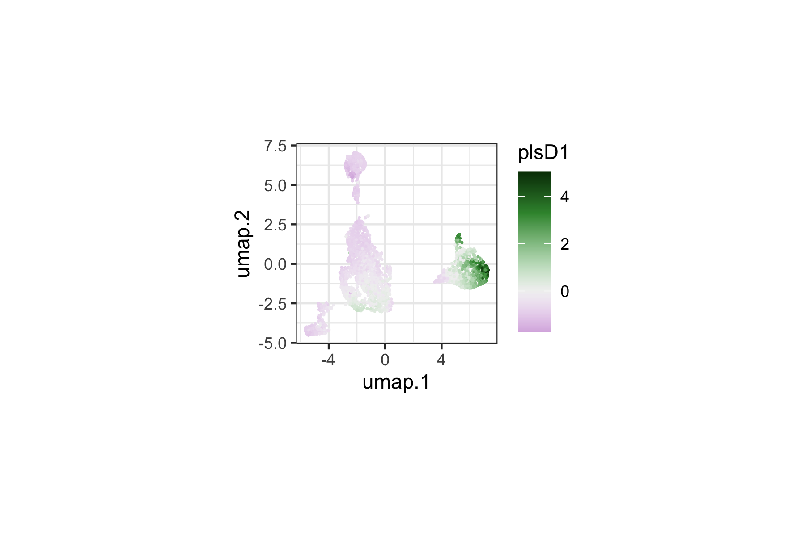
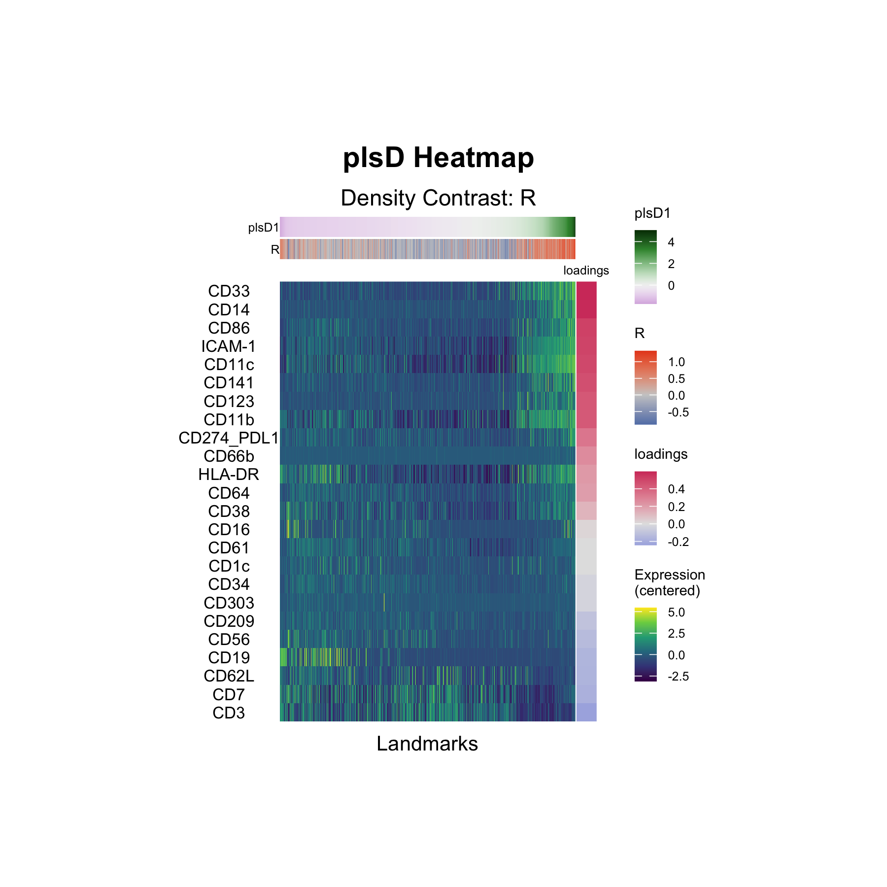

# Cytometry: Anti-PD-1 Response

## Introduction

This vignette demonstrates how `tinydenseR` can be applied to publicly
available clinical mass cytometry (CyTOF) data to identify immune cell
density changes associated with response to anti-PD-1 immunotherapy.
While `tinydenseR` can also be used with scRNA-seq data, it natively
supports cytometry inputs via
[`flowCore::flowSet`](https://rdrr.io/pkg/flowCore/man/flowSet-class.html)
and
[`flowWorkspace::cytoset`](https://rdrr.io/pkg/flowWorkspace/man/cytoset.html)
objects. This vignette illustrates the cytometry workflow end-to-end.

We use data from Krieg et al. (2018), who profiled peripheral blood
mononuclear cells from melanoma patients at baseline (before treatment)
using high-dimensional mass cytometry. Patients were subsequently
classified as responders (R) or non-responders (NR) based on clinical
outcome after anti-PD-1 immunotherapy. A key finding of the original
study was that the frequency of CD14+CD16−HLA-DRhi monocytes before
commencing therapy was a strong predictor of progression-free and
overall survival.

### Analysis Overview

The core workflow follows four steps:

1.  [`RunTDR()`](https://opensource.nibr.com/tinydenseR/reference/RunTDR.md)
    — build landmarks from a `flowSet` with batch correction and compute
    sample-level density profiles.
2.  Visualize landmark and sample embeddings — inspect the UMAP of
    landmarks and the sample PCA to confirm biological structure and
    batch correction.
3.  [`get.lm()`](https://opensource.nibr.com/tinydenseR/reference/get.lm.md)
    — perform differential density analysis controlling for batch
    effects.
4.  [`get.plsD()`](https://opensource.nibr.com/tinydenseR/reference/get.plsD.md)
    — decompose the density contrast into interpretable marker-driven
    components.

### Data Source

The dataset is available from the Bioconductor `HDCytoData` package as
`Krieg_Anti_PD_1_flowSet()`. The original study is described in:

> Krieg C, Nowicka M, Guglietta S, Schindler S, Hartmann FJ, Weber LM,
> Dber R, Robinson MD, Pelber SJ, Christopoulos P, et al.
> *High-dimensional single-cell analysis predicts response to anti-PD-1
> immunotherapy.* Nature Medicine 24, 144–153 (2018).

## Setup

### Load Packages

``` r

library(tinydenseR)
library(dplyr)
library(ggplot2)
library(patchwork)
library(flowCore)
library(HDCytoData)
library(SummarizedExperiment)
```

### Load Data

We load the Krieg et al. anti-PD-1 dataset directly from the
`HDCytoData` Bioconductor package. This returns a `flowSet` containing
one FCS file per sample, with expression data and embedded sample-level
metadata columns (`group_id`, `batch_id`, `sample_id`).

``` r

Krieg_Anti_PD_1 <-
  HDCytoData::Krieg_Anti_PD_1_flowSet()

# Extract marker channel information from the flowSet
MARKER_INFO <-
  Krieg_Anti_PD_1@frames$`BASE_CK_2016-06-23_03_NR1.fcs`@description$MARKER_INFO
```

### Prepare Sample Metadata

The `HDCytoData` package encodes `group_id` (response status),
`batch_id`, and `sample_id` as columns in the expression matrix rather
than in the `flowSet`’s `pData`. We extract these into a sample-level
metadata data frame below. In a typical cytometry workflow, this
metadata would already be available as a data frame or in `pData`; the
extraction here is specific to `HDCytoData`’s encoding convention.

The response group (`group_id`) is derived from the FCS filenames: `R`
for responders and `NR` for non-responders.

``` r

.meta <-
  flowCore::fsApply(
    x = Krieg_Anti_PD_1,
    FUN = flowCore::exprs,
    simplify = FALSE) |>
  lapply(FUN = function(x) {
    
    (x[,colnames(x = x) %in% 
         c("group_id",
           "batch_id",
           "sample_id")] |>
       unique())[1,,drop = TRUE]
    
  }) |>
  dplyr::bind_rows(.id = "fcs_file") |> 
  as.data.frame() |>
  dplyr::mutate(
    group_id = gsub(pattern = "[[:digit:]]*\\.fcs",
                    replacement = "",
                    x = fcs_file,
                    fixed = FALSE) |>
      strsplit(split = "_",
               fixed = TRUE) |>
      lapply(FUN =  tail,
             n = 1) |>
      unlist() |>
      factor(levels = c("NR", "R")),
    batch_id = paste0("batch_",
                      batch_id),
    sample_id = paste0("sample_",
                       sample_id),
    ) |>
  (\(x)
   `rownames<-`(x = x[,colnames(x = x) != "fcs_file"],
                value = x$fcs_file)
  )()
```

The resulting metadata has one row per sample (FCS file), with columns
for response status, batch, and sample identifier:

``` r

.meta
```

### Preprocess Markers

Before analysis, we prepare the `flowSet` by:

1.  Removing the metadata columns (`group_id`, `batch_id`, `sample_id`)
    from the expression data — these are sample-level annotations, not
    markers.
2.  Retaining only channels with an assigned marker class (i.e.,
    excluding channels with `marker_class == "none"`).
3.  Renaming channels from instrument channel names to human-readable
    marker names using the `MARKER_INFO` lookup table.

``` r

# Remove metadata columns from expression data
Krieg_Anti_PD_1 <-
  Krieg_Anti_PD_1[,!colnames(x = Krieg_Anti_PD_1) %in% 
                    c("group_id",
                      "batch_id",
                      "sample_id")]

# Keep only channels with an assigned marker class
Krieg_Anti_PD_1 <-
  Krieg_Anti_PD_1[,colnames(x = Krieg_Anti_PD_1) %in% 
                    MARKER_INFO$channel_name[MARKER_INFO$marker_class != "none"]]

# Rename channels to marker names
colnames(x = Krieg_Anti_PD_1) <-
  MARKER_INFO$marker_name[
    match(x = colnames(x = Krieg_Anti_PD_1),
          table = MARKER_INFO$channel_name)]
```

### Arcsinh Transformation

Mass cytometry data are typically transformed with the inverse
hyperbolic sine (arcsinh) function using a cofactor of 5 to stabilize
variance and compress the dynamic range. This is the standard
transformation for CyTOF data.

``` r

asinhTrans <-
  flowCore::arcsinhTransform(
    transformationId = "arcsinh",
    a = 0,
    b = 1/5,
    c = 0)

Krieg_Anti_PD_1 <-
  flowCore::transform(`_data` = Krieg_Anti_PD_1, 
                      translist = flowCore::transformList(from = colnames(x = Krieg_Anti_PD_1),
                                                          tfun = asinhTrans))
```

### Attach Sample Metadata

We attach the sample-level metadata to the `flowSet`’s `pData`, which
`tinydenseR` uses to identify samples and covariates.

``` r

flowCore::pData(object = Krieg_Anti_PD_1) <-
  cbind(flowCore::pData(object = Krieg_Anti_PD_1),
        .meta[match(x = flowCore::sampleNames(object = Krieg_Anti_PD_1),
                    table = rownames(x = .meta)),
              , drop = FALSE])
```

## Step 1: Build Landmarks with `RunTDR()`

[`RunTDR()`](https://opensource.nibr.com/tinydenseR/reference/RunTDR.md)
is the main entry point. It creates landmark cells, builds a
neighborhood graph, computes sample-level density profiles, and produces
embeddings — all in a single call. For cytometry data, we set
`.assay.type = "cyto"` and provide the `flowSet` directly.

The `.harmony.var = "batch_id"` argument instructs `tinydenseR` to apply
Harmony batch correction during landmark computation, mitigating
technical variation between processing batches. The
`.sample.var = "name"` uses the FCS filenames (the default sample
identifier in `flowSet` `pData`) to define biological samples.

``` r

lm.cells <-
  tinydenseR::RunTDR(
    x = Krieg_Anti_PD_1,
    .sample.var = "name",
    .harmony.var = "batch_id",
    .assay.type = "cyto",
    .seed = 123, # for reproducibility
    .verbose = FALSE
  )
```

## Step 2: Visualize Landmark and Sample Embeddings

Before statistical testing, we inspect the landmark UMAP and sample PCA
to confirm that (1) batch correction was effective and (2) the data
exhibits the expected biological structure.

### Landmark UMAP

We color landmarks by their batch identity to verify that Harmony batch
correction has integrated cells from different batches. Landmarks from
both batches should be intermixed rather than forming separate clusters.

``` r

tinydenseR::plotUMAP(
  x = lm.cells,
  .feature = lm.cells$metadata$batch_id[lm.cells$config$key],
  .plot.title = "batch-corrected landmarks",
  .color.label = "batch_id",
  .cat.feature.color = tinydenseR::Color.Palette[1,c(3,4)],
  .point.size = 0.1,
  .panel.size = 1.5) +
  ggplot2::theme(
    plot.subtitle = ggplot2::element_blank())
```



### Sample PCA

The sample PCA provides a low-dimensional view of inter-sample variation
based on their density profiles across landmarks.

``` r

tinydenseR::plotSampleEmbedding(
  x = lm.cells,
  .embedding = "pca",
  .color.by = "group_id",
  .cat.feature.color = tinydenseR::Color.Palette[1,c(3,4)],
  .panel.size = 1.5,
  .point.size = 3
) +
  ggplot2::labs(title = "Sample PCA") +
  ggplot2::theme(
    plot.title = ggplot2::element_text(hjust = 0.5))
```



When we inspect both the biological variable of interest (`group_id`,
above) and the technical variable (`batch_id`, below), we can clearly
see that `batch_id` remains a dominant source of variation in this
dataset. This is expected since the original study reported strong batch
effects influencing the composition of the immune landscape.
Importantly, the Harmony-correction used above mitigates
expression-level batch effects, while the subsequent linear modeling
will control for batch effects to isolate the cell state density signal
attributable to response status.

``` r

tinydenseR::plotSampleEmbedding(
  x = lm.cells,
  .embedding = "pca",
  .color.by = "batch_id",
  .cat.feature.color = tinydenseR::Color.Palette[1,c(3,4)],
  .panel.size = 1.5,
  .point.size = 3
) +
  ggplot2::labs(title = "Sample PCA") +
  ggplot2::theme(
    plot.title = ggplot2::element_text(hjust = 0.5))
```



## Step 3: Differential Density Analysis with `get.lm()`

### Design Matrix

We set up a design matrix with `~ group_id + batch_id`, which models the
density at each landmark as a function of response status while
controlling for batch effects. This is a standard approach: despite
Harmony correction at the expression level, compositional differences
across batches at the sample level could still confound the analysis.

The column names are cleaned to remove the variable name prefixes for
readability.

``` r

.design <-
  model.matrix(object = ~ group_id + batch_id,
               data = lm.cells$metadata) |> 
  (\(x)
   `colnames<-`(x = x,
                value = colnames(x = x) |>
                  gsub(pattern = "^group_id|batch_id",
                       replacement = "",
                       fixed = FALSE))
  )()
```

### Fit the Model

[`get.lm()`](https://opensource.nibr.com/tinydenseR/reference/get.lm.md)
fits a limma model to the log-transformed fuzzy density profiles across
landmarks. The coefficient `"R"` captures the density log2-fold-change
in responders relative to non-responders (the reference level) at each
landmark.

``` r

lm.cells <- 
  tinydenseR::get.lm(
    x = lm.cells,
    .design = .design,
    .verbose = TRUE
  )
```

### Reduced Model for Sample Embedding

To embed samples along the `group_id` axis specifically, we fit a
reduced model that contains only the batch variable. By comparing the
full and reduced models, `tinydenseR` can separate the density variation
due to response status from that due to batch — producing a sample
embedding that reflects only the biologically meaningful axis.

``` r

nogroup_id.design <- 
  model.matrix(object = ~ batch_id,
               data = lm.cells$metadata)

lm.cells <- 
  tinydenseR::get.lm(
    x = lm.cells,
    .design = nogroup_id.design,
    .model.name = "nogroup_id",
    .verbose = TRUE
  )
```

### Compute Sample Embedding

[`get.embedding()`](https://opensource.nibr.com/tinydenseR/reference/get.embedding.md)
computes a supervised sample embedding (partial-effect PC, pePC) by
comparing the full and reduced models. The resulting pePC captures
sample variation attributable to `group_id` after removing the effect of
`batch_id`.

``` r

lm.cells <-
  tinydenseR::get.embedding(
    x = lm.cells,
    .full.model = "default",
    .red.model = "nogroup_id",
    .term.of.interest = "group_id",
    .verbose = TRUE
  )
```

### Visualize Sample Embedding

The pePC provides a quantitative summary of how each sample deviates
along the response axis, with the fraction of total density variance it
explains reported on the axis labels.

``` r

tinydenseR::plotSampleEmbedding(
  x = lm.cells,
  .embedding = "pePC",
  .sup.embed.slot = "group_id",
  .color.by = "group_id",
  .cat.feature.color = tinydenseR::Color.Palette[1,c(2,1)],
  .panel.size = 1.5,
  .point.size = 3) +
  ggplot2::labs(title = "pePC") +
  ggplot2::theme(
    plot.title = ggplot2::element_text(hjust = 0.5),
    legend.position = "right")
```



### Visualize Differential Density

We overlay the `"R"` coefficient (density log2-fold-change) onto the
landmark UMAP. This reveals which regions of the immune cell landscape
show increased or decreased density in responders relative to
non-responders.

``` r

tinydenseR::plotUMAP(
  x = lm.cells,
  .feature = lm.cells$results$lm$default$fit$coefficients[,"R"],
  .plot.title = "Responders vs. Non-responders",
  .color.label = "density\nlog2(+0.5)FC",
  .panel.size = 1.5,
  .point.size = 0.1,
  .midpoint = 0) +
  ggplot2::theme(
    plot.subtitle = ggplot2::element_blank())
```



We can also restrict the visualization to statistically significant
landmarks (q \< 0.1), categorizing them by the direction of the density
change:

``` r

tinydenseR::plotUMAP(
  x = lm.cells,
  .feature =
    ifelse(
      test = lm.cells$results$lm$default$fit$coefficients[,"R"] < 0,
      yes = "lower density",
      no = "higher density") |>
    ifelse(
      test = lm.cells$results$lm$default$fit$pca.weighted.q[,"R"] < 0.1,
      no = "not sig.") |>
    factor(levels = c("lower density",
                      "higher density",
                      "not sig.")),
  .plot.title = "group_id",
  .color.label = "q < 0.1",
  .cat.feature.color = tinydenseR::Color.Palette[1,c(2,1,6)],
  .point.size = 0.1,
  .panel.size = 1.5,
  .legend.position = "bottom") +
  ggplot2::theme(plot.subtitle = ggplot2::element_blank())
```



Landmarks with significantly higher or lower density in responders span
specific regions of the immune landscape. The spatial pattern on the
UMAP indicates which immune cell populations are differentially
represented between responders and non-responders at baseline.

## Step 4: Decomposing the Density Contrast with `get.plsD()`

Differential density analysis tells us *where* on the landmark landscape
changes occur between responders and non-responders, but not *what*
marker features drive those changes.
[`get.plsD()`](https://opensource.nibr.com/tinydenseR/reference/get.plsD.md)
bridges this gap by decomposing the density contrast into PLS components
whose loadings reveal the markers underlying the signal. In the context
of cytometry data, these loadings correspond to protein markers rather
than gene expression features. We set `.residualize = TRUE` to remove
residual batch-associated variation from the decomposition, ensuring
that plsD components reflect response-related signal rather than
technical artifacts.

``` r

lm.cells <-
  tinydenseR::get.plsD(
    x = lm.cells, 
    .coef.col = "R",
    .model.name = "default",
    .verbose = TRUE,
    .residualize = TRUE
  )
```

### plsD1: Landmark Scores on UMAP

We can color the landmark UMAP by plsD1 scores to visualize which
regions of the immune cell manifold contribute most strongly to the
first component. The plsD1 component captures the dominant axis of
marker expression variation that covaries with the density contrast
between responders and non-responders.

Landmarks with high plsD1 scores are those where the marker program
defined by the plsD1 loadings is most strongly expressed and contributes
to the density differences between groups.

``` r

tinydenseR::plotPlsD(
  x = lm.cells,
  .coef.col = "R",
  .plsD.dim = 1,
  .embed = "umap",
  .panel.size = 1.5,
  .point.size = 0.1
)[[1]] +
  ggplot2::theme(
    plot.title = ggplot2::element_blank(),
    legend.position = "right")
```



### plsD1: Marker Loadings

The plsD1 heatmap displays the marker loadings for the first
density-contrast-aligned component. Each row is a marker, and the
columns correspond to landmark groups ordered by their plsD1 scores. The
loadings reveal which markers drive the density differences captured by
plsD1 — identifying the protein-level signatures that distinguish
responders from non-responders.

``` r

tinydenseR::plotPlsDHeatmap(
  x = lm.cells,
  .coef.col = "R",
  .plsD.dim = 1,
  .order.by = "plsD.dim",
  .panel.height = 3,
  .panel.width = 2,
  .feature.font.size = I(x = 8)
)
```



#### Interpretation

The plsD1 decomposition identifies the dominant axis of marker
expression variation that covaries with the density contrast between
responders and non-responders. The heatmap rows are ranked by their
plsD1 loadings (that is, their contribution to the component).

The top positive loadings form a coherent myeloid/antigen-presenting
program: CD33 (0.61), CD14 (0.60), CD86 (0.53), ICAM-1 (0.52), CD11c
(0.50), CD141 (0.48), CD123 (0.45), and CD11b (0.45). Notably, HLA-DR is
positive (0.22) while CD16 has a near-zero loading (0.02) — consistent
with the original finding by Krieg et al. that CD14+CD16−HLA-DRhi
monocytes are enriched at baseline in patients who respond to anti-PD-1
immunotherapy.

At the negative end of plsD1, lymphocyte markers predominate: CD3
(−0.25), CD7 (−0.19), CD62L (−0.17), CD19 (−0.16), and CD56 (−0.13).
This indicates that landmarks enriched in T, B, and NK cell markers tend
toward higher density in non-responders relative to responders along
this component.

Together, plsD1 separates a myeloid/monocyte-enriched landmark program
(positive loadings, higher density in responders) from a
lymphocyte-enriched program (negative loadings, higher density in
non-responders), providing a data-driven decomposition that aligns with
the reported predictive role of CD14+CD16−HLA-DRhi monocytes in
anti-PD-1 response.

## Summary

This analysis demonstrates the full `tinydenseR` workflow on publicly
available clinical mass cytometry data:

| Step | Function | Purpose |
|----|----|----|
| 1 | [`RunTDR()`](https://opensource.nibr.com/tinydenseR/reference/RunTDR.md) | Build landmarks from a `flowSet`, apply batch correction, compute density profiles |
| 2 | [`plotUMAP()`](https://opensource.nibr.com/tinydenseR/reference/plotUMAP.md), [`plotSampleEmbedding()`](https://opensource.nibr.com/tinydenseR/reference/plotSampleEmbedding.md) | Validate batch correction and biological structure |
| 3 | [`get.lm()`](https://opensource.nibr.com/tinydenseR/reference/get.lm.md) with full and reduced models | Differential density testing, controlling for batch |
| 4 | [`get.plsD()`](https://opensource.nibr.com/tinydenseR/reference/get.plsD.md) | Decompose density contrast into marker-driven components |

This vignette illustrates several features of `tinydenseR` relevant to
cytometry workflows:

- **Native `flowSet` support**:
  [`RunTDR()`](https://opensource.nibr.com/tinydenseR/reference/RunTDR.md)
  accepts
  [`flowCore::flowSet`](https://rdrr.io/pkg/flowCore/man/flowSet-class.html)
  objects directly via `.assay.type = "cyto"`, with no conversion
  required.
- **Batch correction**: Harmony integration is applied during landmark
  construction via `.harmony.var`, with batch effects additionally
  controlled for in the linear model via the design matrix.
- **Nested model embedding**: The full-model / reduced-model approach to
  [`get.embedding()`](https://opensource.nibr.com/tinydenseR/reference/get.embedding.md)
  isolates sample variation attributable to a specific variable of
  interest while removing confounders.
- **plsD for cytometry markers**:
  [`get.plsD()`](https://opensource.nibr.com/tinydenseR/reference/get.plsD.md)
  decomposes density contrasts into marker-driven programs. For
  cytometry data, the loadings correspond to protein markers rather than
  transcriptomic features, providing directly interpretable immune
  phenotyping information.

The dataset analyzed here — baseline CyTOF profiling of melanoma
patients before anti-PD-1 immunotherapy (Krieg et al., 2018) — is
well-suited for this type of analysis because it combines a clearly
defined clinical variable (response status) with high-dimensional immune
phenotyping data and a known biological signal (CD14+CD16−HLA-DRhi
monocytes).

## Session Info

``` r

sessionInfo()
```
