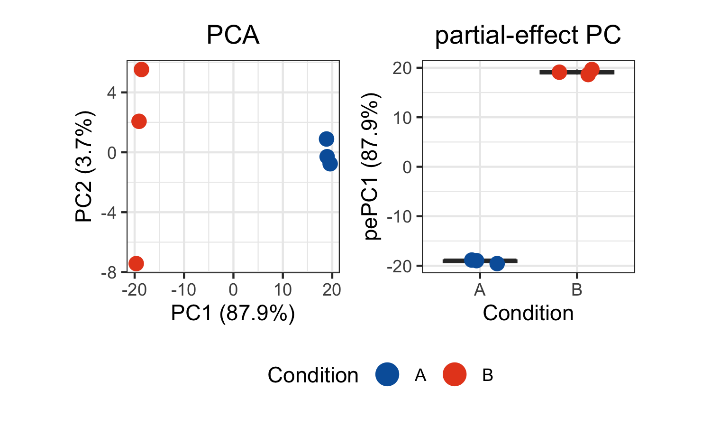
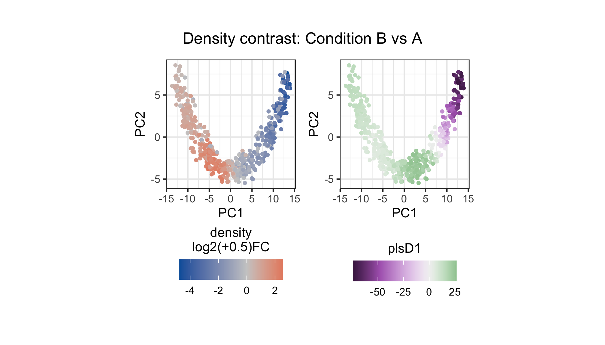
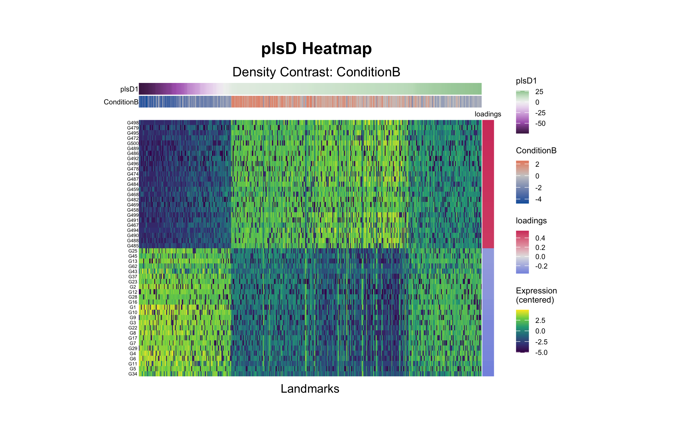

# tinydenseR [](https://opensource.nibr.com/tinydenseR/artwork/tinydenseR_hex_piano_behind.png)

## Table of Contents

- [Overview](#overview)
- [Key Features](#key-features)
- [Installation](#installation)
- [Example](#example)
- [Getting Help](#getting-help)
- [Contributing](#contributing)
- [Citation](#citation)
- [License](#license)
- [Note](#note)

## Overview

`tinydenseR` is a landmark-based platform for single cell data analysis
that identifies differential cell states and features, including subtle
within-cluster state changes. Modeling samples as replicates,
`tinydenseR` enhances analytic efficiency and reproducibility while
preserving the richness of single cell data.

**Why use `tinydenseR`?** Traditional single-cell analysis methods rely
heavily on clustering, which can be oversimplified and subjective.
`tinydenseR` provides a clustering-independent framework that preserves
biological complexity while maintaining statistical rigor.

For details, check out our [preprint on
bioRxiv](https://doi.org/10.1101/2025.11.26.690752)!

### Method Schematics

[](https://opensource.nibr.com/tinydenseR/man/figures/README1.png)

## Key Features

- **🎯 Sample-centric analysis**: Treats samples, not cells, as
  biological replicates for proper statistical modeling
- **🚀 Memory efficient**: Handles atlas-scale datasets with minimal
  memory footprint  
- **🔬 Multi-technology support**: Works with scRNA-seq, flow cytometry,
  mass cytometry (multi-modal data support coming soon)
- **📊 Rich visualizations**: Built-in plotting functions for exploring
  results
- **🔗 Clinical integration**: Links cell-level variation to clinical
  and experimental outcomes
- **⚡ Fast processing**: Efficient algorithms for large-scale data
  analysis

## Installation

### Dependencies

`tinydenseR` requires R (\>= 4.1) and a few Bioconductor and CRAN
packages. Most dependencies will be installed automatically, but you may
need to install Bioconductor and its dependencies first:

``` r

if (!requireNamespace("BiocManager", quietly = TRUE)) {
  install.packages("BiocManager")
}

# Download DESCRIPTION from GitHub
data_url <-
  "https://raw.githubusercontent.com/Novartis/tinydenseR/main/DESCRIPTION"
temp_file <-
  tempfile()
utils::download.file(
  url = data_url, 
  destfile = temp_file, 
  mode = "wb",
  quiet = TRUE)

# Parse Imports
desc <-
  read.dcf(file = temp_file)
imports <-
  strsplit(x = desc[, "Imports"],
           split = "\\s*,\\s*")[[1]]
imports <-
  gsub(pattern = "\\s*\\(.*?\\)", 
       replacement = "", 
       x = imports)  # remove version constraints

# Install only missing Bioconductor packages
avail.bioc.pkgs <-
  BiocManager::repositories() |>
  (\(x)
  available.packages(repos = x)
  )() |>
  rownames() 

bioc_pkgs <-
  imports[imports %in%
            avail.bioc.pkgs[!avail.bioc.pkgs %in% 
                              (installed.packages() |>
                                 rownames())]]
if (length(bioc_pkgs) > 0) {
  BiocManager::install(pkgs = bioc_pkgs,
                       update = FALSE)
}

unlink(temp_file)
```

You can install `tinydenseR` from GitHub using devtools:

``` r

# Install devtools if you haven't already
if (!require("devtools")) install.packages("devtools")

# Install `tinydenseR`
devtools::install_github("Novartis/tinydenseR")
```

### Example Data

The example below uses a bundled synthetic scRNA-seq trajectory dataset
(`sim_trajectory_tdr`).

## Example

This example demonstrates the `tinydenseR` workflow on a synthetic
scRNA-seq trajectory dataset with two conditions (A and B) and three
replicates per condition (5,000 cells, 500 genes). Condition effects are
introduced by systematically varying the proportion of cells assigned to
each condition at each trajectory milestone, creating differential
cell-state abundance along the trajectory.

### Load Libraries and Data

``` r

library(tinydenseR)
#> Loading required package: Matrix
#> Loading required package: patchwork
library(ggplot2)
library(patchwork)
library(ggh4x)


# Load bundled simulation data
data(sim_trajectory_tdr, package = "tinydenseR")

sim_trajectory <- sim_trajectory_tdr$sce
rm(sim_trajectory_tdr)
```

### Build Landmarks with `RunTDR()`

[`RunTDR()`](https://opensource.nibr.com/tinydenseR/reference/RunTDR.md)
selects landmark cells, builds a nearest-neighbor graph, clusters
landmarks, maps all cells to their nearest landmarks to generate the
landmark-by-sample matrix in a single call. Unsupervised sample
embedding is also returned automatically.

``` r

sim_trajectory <-
  tinydenseR::RunTDR(
    x = sim_trajectory,
    .sample.var = "Sample",
    .assay.type = "RNA",
    .nHVG = 500,
    .verbose = FALSE,
    .seed = 123 # for reproducibility
  )
#> Loading required namespace: SingleCellExperiment
#> Warning in (function (A, nv = 5, nu = nv, maxit = 1000, work = nv + 7, reorth =
#> TRUE, : You're computing too large a percentage of total singular values, use a
#> standard svd instead.
```

### Differential Density Analysis with `get.lm()`

We set up a design matrix and test which landmarks show differential
density between conditions.

``` r

.design <-
  model.matrix(~ Condition,
               data = tinydenseR::GetTDR(sim_trajectory)@metadata)

sim_trajectory <-
  tinydenseR::get.lm(
    x = sim_trajectory,
    .design = .design,
    .verbose = FALSE
  )
#> Warning in get.lm.TDRObj(tdr, ...): PCA-weighted q-value estimation is not
#> recommended for fewer than 1000 tests. Using standard q-value estimation
#> instead.
#> Warning in value[[3L]](cond): q-value estimation failed. Using BH instead.
#> Warning in get.lm.TDRObj(tdr, ...): Only 1 cluster detected. Skipping limma fit
#> on cluster composition (nothing to compare). Density-level analysis (get.plsD,
#> get.dea, etc.) is unaffected.
```

### Sample Embedding

We fit a reduced (intercept-only) model and compute partial-effect PCs
to produce a quantitative per-sample score along the Condition axis.

``` r

# Reduced model (no Condition term)
noCondition.design <-
  model.matrix(~ 1,
               data = tinydenseR::GetTDR(sim_trajectory)@metadata)

sim_trajectory <-
  tinydenseR::get.lm(
    x = sim_trajectory,
    .design = noCondition.design,
    .model.name = "noCondition",
    .verbose = FALSE
  )
#> Warning in get.lm.TDRObj(tdr, ...): PCA-weighted q-value estimation is not
#> recommended for fewer than 1000 tests. Using standard q-value estimation
#> instead.
#> Warning in get.lm.TDRObj(tdr, ...): Only 1 cluster detected. Skipping limma fit
#> on cluster composition (nothing to compare). Density-level analysis (get.plsD,
#> get.dea, etc.) is unaffected.

# Compute partial-effect PCs
sim_trajectory <-
  tinydenseR::get.embedding(
    x = sim_trajectory,
    .full.model = "default",
    .red.model = "noCondition",
    .term.of.interest = "Condition",
    .verbose = FALSE
  )
```

``` r

# Unsupervised sample PCA
smpl.pca <-
  tinydenseR::plotSampleEmbedding(
    x = sim_trajectory,
    .embedding = "pca",
    .color.by = "Condition",
    .cat.feature.color = tinydenseR::Color.Palette[1, c(1, 2)],
    .panel.size = 1.5,
    .point.size = 3
  ) +
  ggplot2::labs(title = "PCA") +
  ggplot2::theme(plot.title = ggplot2::element_text(hjust = 0.5),
                 legend.position = "bottom")

# Supervised partial-effect PC
smpl.pePC <-
  tinydenseR::plotSampleEmbedding(
    x = sim_trajectory,
    .embedding = "pePC",
    .sup.embed.slot = "Condition",
    .color.by = "Condition",
    .cat.feature.color = tinydenseR::Color.Palette[1, c(1, 2)],
    .panel.size = 1.5,
    .point.size = 3
  ) +
  ggplot2::labs(title = "partial-effect PC") +
  ggplot2::theme(plot.title = ggplot2::element_text(hjust = 0.5),
                 legend.position = "bottom")

(smpl.pca | smpl.pePC) +
  patchwork::plot_layout(guides = "collect") &
  ggplot2::theme(legend.position = "bottom",
                 legend.justification = "center")
```



The unsupervised PCA shows inter-sample variation based on density
profiles across landmarks. The supervised partial-effect PC isolates
variation along the Condition axis, clearly separating the two groups.

### Density Contrast and plsD

We decompose the density contrast into interpretable gene-expression
programs using
[`get.plsD()`](https://opensource.nibr.com/tinydenseR/reference/get.plsD.md),
and visualize the result as a patchwork of the density fold-change and
plsD1 scores on the landmark PCA.

``` r

sim_trajectory <-
  tinydenseR::get.plsD(
    x = sim_trajectory,
    .coef.col = "ConditionB",
    .model.name = "default",
    .verbose = FALSE
  )
```

``` r

# Density fold-change on landmark PCA
dens.p <-
  tinydenseR::plotPCA(
    x = sim_trajectory,
    .feature = tinydenseR::GetTDR(sim_trajectory)@results$lm$default$fit$coefficients[, "ConditionB"],
    .panel.size = 1.5,
    .point.size = 1,
    .color.label = "density\nlog2(+0.5)FC",
    .midpoint = 0,
    .legend.position = "bottom"
  ) +
  ggplot2::guides(color = ggplot2::guide_colorbar(title.position = "top",
                                                  title.hjust = 0.5)) +
  ggplot2::theme(plot.subtitle = ggplot2::element_blank(),
                 legend.margin = ggplot2::margin(t = -0.1, unit = "in"))

# plsD1 scores on landmark PCA
plsD1.p <-
  tinydenseR::plotPlsD(
    x = sim_trajectory,
    .coef.col = "ConditionB",
    .plsD.dim = 1,
    .embed = "pca",
    .panel.size = 1.5
  )[[1]]

# Patchwork: density contrast | plsD1
((dens.p +
    ggplot2::labs(title = "") +
    ggplot2::theme(legend.margin = ggplot2::margin(t = -0.1,
                                                   unit = "in"))) |
   (plsD1.p +
      ggplot2::labs(title = "") +
      ggplot2::theme(legend.margin = ggplot2::margin(t = 0.1,
                                                     unit = "in")))) +
  patchwork::plot_annotation(title = "Density contrast: Condition B vs A") &
  ggplot2::theme(
    plot.title =
      ggplot2::element_text(hjust = 0.5,
                            margin = ggplot2::margin(t = -0.1,
                                                     unit = "in")))
```



The left panel shows density log2 fold-change at each landmark:
landmarks enriched in Condition B are red, those enriched in A are blue.
The right panel shows plsD1 scores, which capture the leading
gene-expression program aligned with the density contrast.

### plsD Heatmap

The plsD heatmap shows landmark expression profiles ordered by plsD1
scores, with gene loadings on the right. Rows display centered
expression of the top 25 features associated with each direction of
plsD1.

``` r

tinydenseR::plotPlsDHeatmap(
  x = sim_trajectory,
  .coef.col = "ConditionB",
  .plsD.dim = 1,
  .order.by = "plsD.dim",
  .panel.height = 3,
  .feature.font.size = 4
)
```



tinydenseR recovered trajectory-associated cell-state changes, embedded
samples along the variable of interest, and uncovered gene-expression
programs associated with changes in cell density, illustrating its
ability to model continuous cellular and molecular variation without
relying on hard cluster boundaries.

## Getting Help

### Documentation

- **Function documentation**: Use `?function_name` in R for detailed
  help on any function

- **Reproducible scripts**: Check the `inst/scripts/` directory for
  example workflows

### Troubleshooting Common Issues

**Installation problems:**

- Ensure you have R \>= 4.1

- Install BiocManager first: `install.packages("BiocManager")`

- Try installing dependencies manually if automatic installation fails

**Questions and Support:**

- 🐛 Report bugs: [GitHub
  Issues](https://github.com/Novartis/tinydenseR/issues)

- 💬 Discussions: Use GitHub Discussions for general questions

## Contributing

We welcome contributions to `tinydenseR`! Here’s how you can help:

### Types of Contributions

- 🐛 **Bug reports**: Found an issue? Please report it!

- ✨ **Feature requests**: Have an idea for improvement? We’d love to
  hear it!

- 📖 **Documentation**: Help improve our docs and examples

- 🧪 **Testing**: Add test cases or test on your data

- 💻 **Code**: Submit bug fixes or new features

### How to Contribute

1.  **Fork** the repository on GitHub

2.  **Create** a new branch for your changes

3.  **Make** your changes and add tests if applicable

4.  **Test** your changes thoroughly

5.  **Submit** a pull request with a clear description

## Citation

If you use `tinydenseR` in your research, please cite:

``` R
Milanez-Almeida, P. et al. (2025). Sample-level modeling of single-cell data at scale with tinydenseR. bioRxviv https://doi.org/10.1101/2025.11.26.690752.
```

## License

The code is licensed under the MIT License (see
[LICENSE.md](https://opensource.nibr.com/tinydenseR/LICENSE.md)).

The sticker artwork (PNG) is licensed under CC0 (see
[LICENSE-artwork](https://opensource.nibr.com/tinydenseR/LICENSE-artwork)).

Copyright 2025 Novartis Biomedical Research Inc.

## Note

This is an open‑source package by the authors; not an official Novartis
mark or program.

------------------------------------------------------------------------

*tinydenseR: Making single-cell analysis more rigorous, one sample at a
time* 🧬📊
